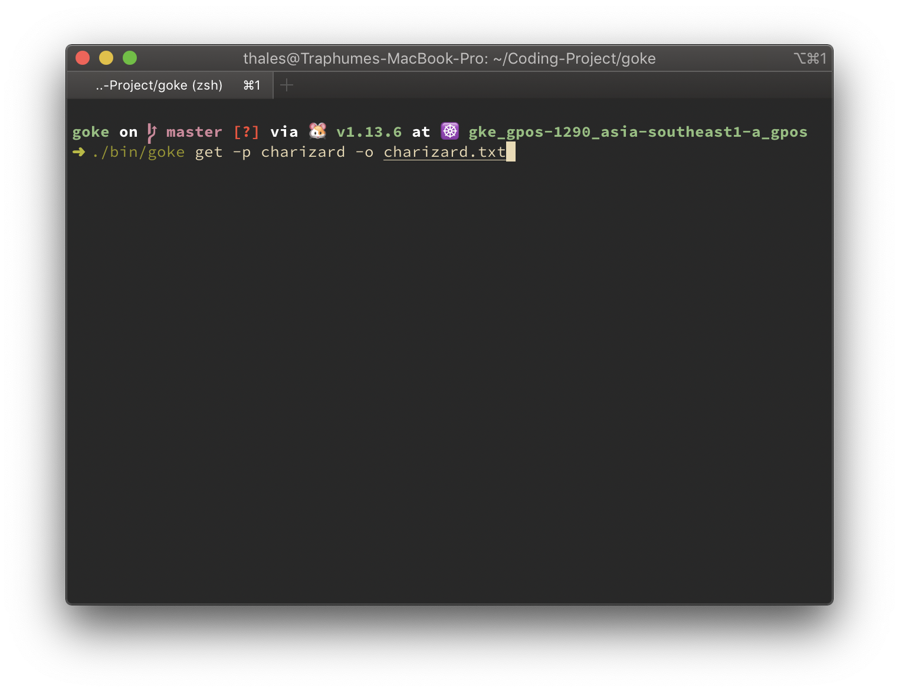

# Goke
Run the binaries `goke` in `/bin` to use the cli program. Include the `--help` flag to view usage, commands and flags for the program. This is an example of the command `get` help page.

The `get` command retrieve pokemon information from PokéAPI. The `name` flag is required. Below is an example of the `get` command usage.

 
 
 
